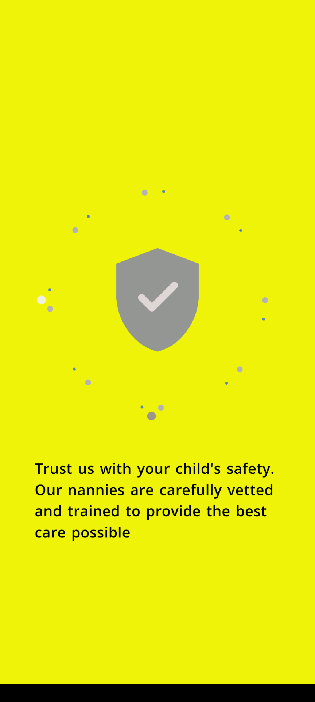
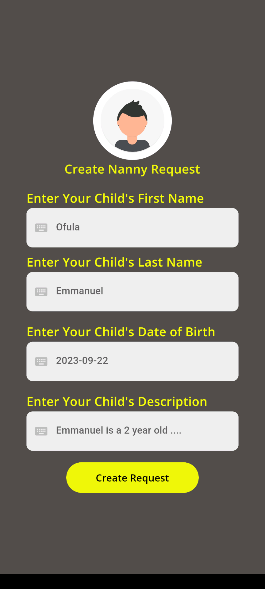
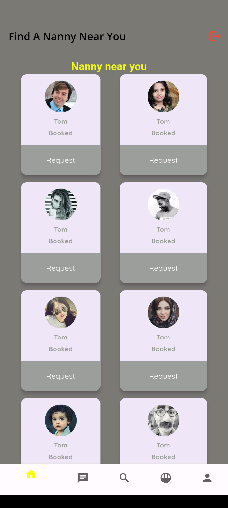

# PataNanny - Connecting Parents and Nannies


PataNanny is a mobile application built with Flutter that facilitates the connection between parents and nannies. Whether you are a parent looking for a trusted nanny to take care of your child or a nanny searching for job opportunities, PataNanny provides a platform for seamless communication and collaboration.

## Table of Contents

- [Features](#features)
- [Screenshots](#screenshots)
- [Getting Started](#getting-started)
- [Prerequisites](#prerequisites)
- [Installation](#installation)
- [Usage](#usage)
- [Contributing](#contributing)
- [License](#license)

## Features

- **User Registration**: Parents and nannies can create accounts and profiles.
- **Search Nannies**: Parents can search for available nannies based on various criteria.
- **Messaging**: In-app messaging system for parents and nannies to communicate.
- **Profile Management**: Update and manage profiles with personal information, availability, and preferences.
- **Ratings and Reviews**: Parents can provide feedback and ratings for nannies.
- **Notifications**: Receive notifications for new messages and job offers.
- **Secure Authentication**: User data is protected through secure authentication methods.
- **Responsive Design**: The app is designed to work well on various devices and screen sizes.

## Image Gallery
<table>
  <tr>
    <td>
      
    </td>
    <td>
      
    </td>
  </tr>
  <tr>
    <td>
      
    </td>
    <td>
      
    </td>
  </tr>
  <tr>
    <td>
      
    </td>
    <td>
      
    </td>
  </tr>
</table>

## Getting Started

These instructions will help you get a copy of the project up and running on your local machine for development and testing purposes.

### Prerequisites

- [Flutter](https://flutter.dev/) installed on your development machine.
- A compatible IDE, such as [Visual Studio Code](https://code.visualstudio.com/) or [Android Studio](https://developer.android.com/studio).
- An Android or iOS emulator, or a physical device for testing.

### Installation

1. Clone the repository:

   ```bash
   git clone https://github.com/Njuguna-JohnBrian/PataNanny.git
   ```

2. Navigate to the project directory:

   ```bash
   cd PataNanny
   ```

3. Install the required dependencies:

   ```bash
   flutter pub get
   ```

### Usage

1. Start your Flutter development environment.

2. Build and run the app on your preferred emulator or physical device:

   ```bash
   flutter run
   ```

3. You can now use the app to register as a parent or nanny, search for nannies, and communicate with potential caregivers.

## Contributing

We welcome contributions from the open-source community. If you'd like to contribute to PataNanny, please follow these guidelines:

1. Fork the repository.

2. Create a new branch for your feature or bug fix: `git checkout -b feature-name`.

3. Make your changes, and ensure your code is well-documented and follows the project's coding style.

4. Test your changes thoroughly.

5. Push your changes to your fork: `git push origin feature-name`.

6. Create a pull request to the main repository.

## License

This project is licensed under the MIT License - see the [LICENSE](LICENSE) file for details.

---

Happy parenting and nanny searching with PataNanny! If you have any questions, issues, or suggestions, please feel free to reach out to us or open an issue on this repository.